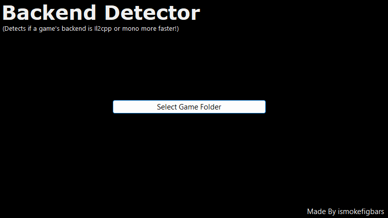

# Unity Backend Detector & Extractor

A Winform tool to detect if a Unity game uses **Mono** or **IL2CPP** scripting backend, and extracts the key files needed for analysis or modding.

---

## Features

- Detects if a Unity game uses **Mono** or **IL2CPP** backend
- Automatically copies:
  - **Mono**: `Assembly-CSharp.dll`
  - **IL2CPP**: `GameAssembly.dll`, `global-metadata.dat`, and `libil2cpp.so`
- Creates folders in the tool's folder for extracted files

---

## Requirements

- [.NET Framework 4.7.2](https://dotnet.microsoft.com/en-us/download/dotnet-framework/net472) or later
- Unity game folder to analyze

---

## Notes

- IL2CPP native libs (`libil2cpp.so`) are detected if located in common Unity folder paths
- I won't be updating this tool!
  
---
